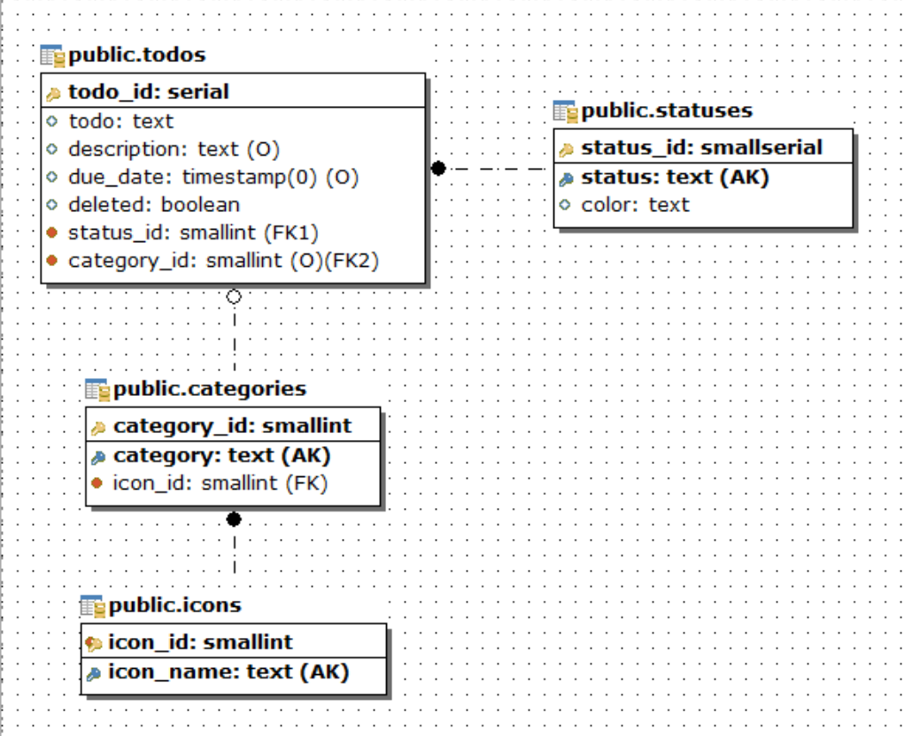

# Схема данных

Схема данных представлена на рисунке:

Для реализации в redux нужно учитывать следующие ограничения, исходя из схемы данных:

Icons:

-   Идентификатор (id) должен быть целочисленного типа.
-   Обязательно должно присутствовать поле name.
-   Длина поля name должна быть не менее 5 символов и не более 50 символов.
-   Удаление иконки невозможно, если на неё ссылается хотя бы одна категория.

Statuses:

-   Идентификатор (id) должен быть целочисленного типа.
-   Обязательно должно присутствовать поле status.
-   Длина поля name должна быть не менее 3 символов и не более 20 символов.
-   Обязательно должно присутствовать поле color.
-   Длина поля name должна быть 7 символов.
-   Удаление статуса невозможно, если на него ссылается хотя бы одна задача (Todo).

Category:

-   Идентификатор (id) должен быть целочисленного типа.
-   Поле icon_id должно быть целочисленного типа и должно ссылаться на существующую иконку в списке Icons.
-   Обязательно должно присутствовать поле category, и его длина должна быть более 3-х символов и не должна превышать 20 символов, оно должно начинаться большой буквы (преобразовывать в редьюсере).
-   Удаление категории невозможно, если на неё ссылается хотя бы одна задача (Todo).

Todos:

-   Идентификатор (id) должен быть целочисленного типа.
-   Поле status_id должно быть целочисленного типа и должно ссылаться на существующий статус в списке Statuses.
-   Поле category_id должно быть целочисленного типа и должно ссылаться на существующую категорию в списке Categories, либо оно может быть неопределенным.
-   Длина поля todo должна быть не менее 5 символов и не более 150 символов.
-   Поле description должно иметь длину не менее 10 символов и не более 1000 символов, либо оно может быть неопределенным.
-   Поле deleted должно быть логическим типом и по умолчанию должно быть установлено в false.
-   Поле completed должно быть логическим типом и по умолчанию должно быть установлено в false, либо оно может быть неопределенным.

На базе схемы данных составим описание типов сех сущностей в `entities.d.ts`:
